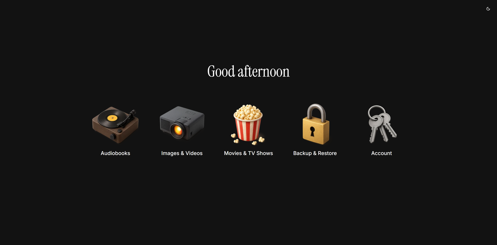

<div align="center">
  <a href="https://iso.tim.cv/" target="_blank">
    
  </a>
</div>

<br />
<div align="center">
  <a href="https://iso.tim.cv" target="_blank">Demo</a>
  |
  <a href="https://hub.docker.com/r/coyann/iso" target="_blank">Docker</a>
  |
  <a href="https://github.com/Coyenn/iso/" target="_blank">GitHub</a>
</div>
<br />

**Iso** is a plug-and-play dashboard for all your self-hosted services.
Built for my personal homelab — now open-sourced for yours.

- **Fully configurable** through a single `config.json` file
- **Multi-language**: English, Español, Français, Deutsch
- **Icon ready**: choose from a set of built-in icons or supply your own
- **Docker-first**: run anywhere with one simple command

## ‍️Quick Start

```bash
docker run -d \
  --name iso \
  -p 3000:3000 \
  coyann/iso
```

Open http://localhost:3000 and you’re up and running!

### With a custom config

1. Create a `config.json` (see [Configuration](#-configuration)).
2. Mount it into the container at `/app/config.json`:

```bash
docker run -d \
  --name iso \
  -p 3000:3000 \
  -v $(pwd)/config.json:/app/config.json:ro \
  coyann/iso
```

### Adding custom icons

```bash
# Assuming your icons live in ./my-icons
# They will be available at http://<ISO_URL>/custom-icons/<filename>
docker run -d \
  --name iso \
  -p 3000:3000 \
  -v $(pwd)/config.json:/app/config.json:ro \
  -v $(pwd)/my-icons:/app/public/custom-icons:ro \
  coyann/iso
```

Refer to them in your `config.json` just like this:

```json
{
  "services": [
    {
      "icon": "/custom-icons/unifi.png",
      "label": "UniFi Controller",
      "href": "https://unifi.my-home.local"
    }
  ]
}
```

### Adding custom CSS overrides

```bash
# Assuming your overrides live in ./iso-dashboard/css directory
# Any .css files inside this folder will automatically be injected into the <head> of Iso at runtime
# They can be used to tweak colors, spacing, etc.
docker run -d \
  --name iso \
  -p 3000:3000 \
  -v $(pwd)/config.json:/app/config.json:ro \
  -v $(pwd)/iso-dashboard/css:/app/public/css:ro \
  coyann/iso
```

All stylesheets mounted in `/app/public/css` will be served at `http://<ISO_URL>/css/<filename>` and automatically loaded by Iso in the order returned by the file system (typically alphabetical). This lets you fully override Tailwind variables or add your own custom rules without rebuilding the image.

## Configuration

Iso is driven entirely by a single JSON file.

### Example `config.json`

```json5
{
  "title": "My Homelab",
  "services": [
    {
      "icon": "recordPlayer", // built-in icon from Iso
      "label": "Audiobooks",
      "href": "https://audiobooks.my-home.local"
    },
    {
      "icon": "/custom-icons/unifi.png", // custom icon
      "label": "UniFi Controller",
      "href": "https://unifi.my-home.local"
    }
  ],
  "locale": "en",
  "customGreetings": {
    "morning": "Rise and shine!",
    "afternoon": "Hey there!",
    "evening": "Good evening 😊",
    "night": "Sleep tight"
  }
}
```

## License

Distributed under the MIT License. See `LICENSE` for more information.
